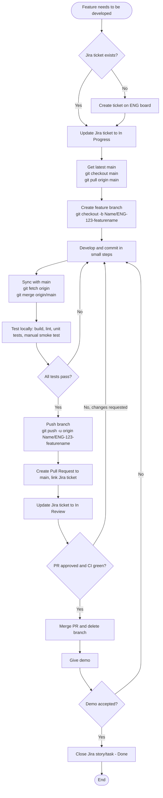
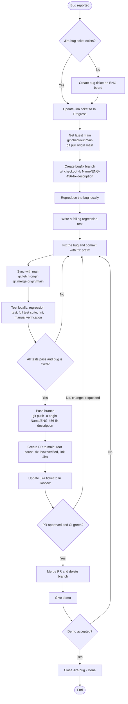
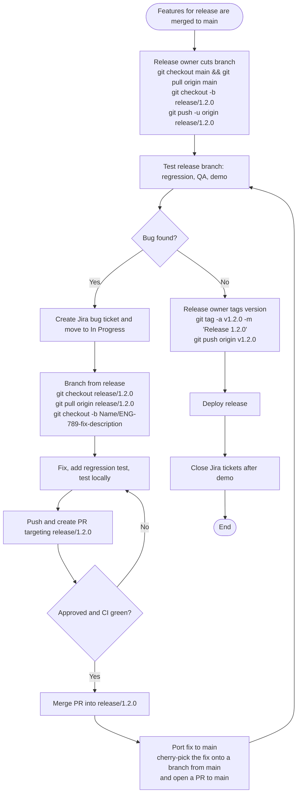

# Git Check-in Process

This process applies to **every feature (story/task) and every bug fix** in the code repo.

- **Code repo:** https://github.com/CricketStop/ClubManagerWebApp.git
- **Jira board:** https://cybermentors-in.atlassian.net/jira/software/projects/ENG/boards/1 (project key `ENG`)
- **Rule:** never commit directly to `main`. All changes go through a branch and a pull request.

---

## 1. One-time setup: clone the repo

```bash
git clone https://github.com/CricketStop/ClubManagerWebApp.git
cd ClubManagerWebApp
git config user.name "Your Name"
git config user.email "you@example.com"
git remote -v        # verify origin points to ClubManagerWebApp
```

All commands below are run inside the `ClubManagerWebApp` folder.

---

## 2. Branch naming

Format: `Name/JIRA_No-featurename`

| Type | Example |
|------|---------|
| Feature | `Vignesh/ENG-123-user-login` |
| Bug fix | `Vignesh/ENG-456-fix-login-crash` |

Use your first name with the first letter capitalized (e.g. `Vignesh`), the Jira ticket number, and a short kebab-case description.

Release branches use a different format: `release/<version>`, e.g. `release/1.2.0`. Only the team lead / release owner creates them.

| Branch | Created from | PR targets |
|--------|--------------|------------|
| `Name/ENG-No-featurename` (feature, normal bug fix) | `main` | `main` |
| `Name/ENG-No-fix-description` (release bug fix) | `release/<version>` | `release/<version>` |
| `release/<version>` | `main` | none, it is merged/tagged at release |

---

## 3. Pushing changes to remote

Push your branch to `origin` (GitHub) whenever you want a backup, need help, or are ready for a PR. Always push to your own branch, never to `main` or `release/<version>`.

1. **Check what you are about to push:**
   ```bash
   git status                       # working tree should be clean (everything committed)
   git branch --show-current        # confirm you are on your Name/ENG-No-featurename branch
   git log origin/main..HEAD --oneline   # commits that will be in your PR
   ```
2. **Sync with main first** so conflicts are resolved locally:
   ```bash
   git fetch origin
   git merge origin/main
   ```
3. **Test locally** (build, lint, unit tests). Do not push failing code for review.
4. **First push of a new branch** (sets upstream tracking):
   ```bash
   git push -u origin Vignesh/ENG-123-user-login
   ```
5. **Later pushes** on the same branch:
   ```bash
   git push
   ```
6. **Verify:** open the repo on GitHub, check that the branch and commits are there, then create the PR (GitHub shows a "Compare & pull request" banner, or use `gh pr create`).

If the push is rejected (`non-fast-forward` / `fetch first`), the remote has commits you don't have: run `git pull origin <your-branch>` (or `git merge origin/<your-branch>`), resolve conflicts, re-test, and push again. Do not force push.

---

## 4. Feature development workflow



### Steps

1. **Update Jira:** move the ticket to **In Progress** before you start.
2. **Get latest from main:**
   ```bash
   git checkout main
   git pull origin main
   ```
3. **Create your feature branch:**
   ```bash
   git checkout -b Vignesh/ENG-123-user-login
   ```
4. **Develop and commit** in small, meaningful commits. Prefix messages with `feat:`.
   ```bash
   git add <files>
   git commit -m "feat: add login form validation (ENG-123)"
   ```
5. **Sync with main** to pick up others' changes and resolve conflicts locally:
   ```bash
   git fetch origin
   git merge origin/main
   ```
6. **Test locally.** Build, lint, run unit tests, and manually verify the feature. Do not push until everything passes.
7. **Push your branch:**
   ```bash
   git push -u origin Vignesh/ENG-123-user-login
   ```
8. **Create the PR** against `main` (GitHub UI, or `gh pr create`). Include:
   - Title starting with the ticket number, e.g. `ENG-123: Add user login`
   - What changed and why, how it was tested, link to the Jira ticket
   - At least one reviewer
9. **Update Jira** to **In Review**.
10. **Address review comments** with new commits, re-test, and push.
11. **Merge** (squash) once approved and CI is green; delete the branch, then:
    ```bash
    git checkout main
    git pull origin main
    ```
12. **Give a demo.** The story/task is closed in Jira **only after the demo** is accepted, not on merge. If the demo needs changes, go back to development on a new branch following the same flow.

---

## 5. Bug fix workflow



The steps are the same as the feature workflow, with these differences:

1. **Reproduce the bug first** and note the steps in the Jira ticket.
2. **Write a failing regression test** that proves the bug, then fix the code until it passes.
3. Use the commit prefix `fix:`, e.g. `fix: prevent crash when email is empty (ENG-456)`.
4. The **PR description must include** the root cause, what the fix is, and how you verified it.
5. For urgent production issues, tell the team lead; use the release bug fix flow in section 6 and fast-track the review.

---

## 6. Release branch workflow

A release branch freezes a set of features for testing and release while `main` keeps moving. Only bug fixes go into a release branch, never new features.



### Steps

1. **Cut the release branch (release owner):**
   ```bash
   git checkout main
   git pull origin main
   git checkout -b release/1.2.0
   git push -u origin release/1.2.0
   ```
   After this, do not merge new features into the release branch. Features continue to go to `main` and ship in the next release.
2. **Fix a bug found on the release branch:**
   ```bash
   git fetch origin
   git checkout release/1.2.0
   git pull origin release/1.2.0
   git checkout -b Vignesh/ENG-789-fix-payment-total
   ```
   Move the Jira ticket to In Progress, fix the bug with a regression test, commit with `fix:`, test locally, and push.
3. **Open the PR targeting `release/1.2.0`** (not `main`). Include root cause, fix, how verified, and the Jira link. Move Jira to In Review.
4. **Port the fix to `main`** so it is not lost in the next release. After the release PR merges:
   ```bash
   git checkout main
   git pull origin main
   git checkout -b Vignesh/ENG-789-fix-payment-total-main
   git cherry-pick <commit-sha-from-release-branch>
   git push -u origin Vignesh/ENG-789-fix-payment-total-main
   ```
   Open a PR to `main`. If the fix is not needed on `main` (code already changed), note that in the ticket.
5. **Tag and release (release owner)** once the release branch is tested and demoed:
   ```bash
   git checkout release/1.2.0
   git pull origin release/1.2.0
   git tag -a v1.2.0 -m "Release 1.2.0"
   git push origin v1.2.0
   ```
6. **Close tickets** after the demo is accepted. Keep the release branch for hotfixes (`1.2.1`), or delete it once the release is no longer supported.

---

## 7. Quick reference

| | Feature | Bug fix (main) | Bug fix (release) |
|---|---|---|---|
| Jira at start | In Progress | In Progress | In Progress |
| Branch from | `main` | `main` | `release/<version>` |
| Branch name | `Name/ENG-123-featurename` | `Name/ENG-456-fix-description` | `Name/ENG-789-fix-description` |
| PR targets | `main` | `main` | `release/<version>`, then port to `main` |
| Commit prefix | `feat:` | `fix:` | `fix:` |
| Extra requirement | Tests for new behavior | Failing regression test first | Regression test, cherry-pick to `main` |
| PR description | What, why, how tested | Root cause, fix, how verified | Root cause, fix, how verified |
| Jira after PR opened | In Review | In Review | In Review |
| Closed when | After demo | After demo | After demo |

---

## 8. Checklists

**Before pushing**
- [ ] Branch created from latest `main` (or the latest `release/<version>` for a release bug fix), named `Name/ENG-No-featurename`
- [ ] Merged latest `origin/main` into the branch, conflicts resolved
- [ ] Build, lint and tests pass locally
- [ ] Feature or fix manually verified
- [ ] No secrets, debug code or unrelated changes committed

**Before requesting review**
- [ ] PR title starts with the Jira number
- [ ] Description explains what, why and how it was tested
- [ ] Jira ticket linked and moved to In Review
- [ ] Reviewer assigned
- [ ] PR targets the correct base branch (`main` or `release/<version>`)

---

## 9. Common issues

| Problem | Fix |
|---------|-----|
| Committed on `main` by mistake (not pushed) | `git switch -c Name/ENG-123-featurename` then `git switch main && git reset --hard origin/main` |
| Merge conflicts | Edit the conflicted files, `git add <files>`, `git commit` (or `git merge --abort` to start over) |
| Need to change the last commit message | `git commit --amend` (only if not pushed) |
| Undo last commit but keep changes | `git reset --soft HEAD~1` |
| Uncommitted work blocks switching branches | `git stash`, switch, then `git stash pop` |
